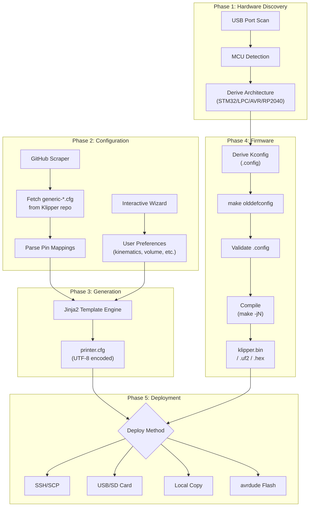

# KACE — Product Requirements Document

**Version:** v0.1.0-beta → **v1.0.0 target**
**Repository:** [github.com/3D-uy/kace](https://github.com/3D-uy/kace)
**License:** GPL-3.0
**Platform:** Linux / Raspberry Pi (primary), Windows/CI (development/testing)
**Last Updated:** 2026-04-17

---

## 1. Executive Summary

**KACE** (Klipper Automated Configuration Ecosystem) is an intelligent CLI tool that automates the entire Klipper 3D printer setup process — from hardware detection to firmware compilation and configuration generation. It eliminates the most error-prone steps of Klipper adoption: manually creating `printer.cfg` files, selecting correct firmware settings, and mapping board pin configurations.

The tool scrapes real-time configuration data from the official [Klipper GitHub repository](https://github.com/Klipper3d/klipper), auto-detects connected MCU hardware, and guides users through an interactive wizard to produce a ready-to-use configuration.

### Vision

> Make Klipper accessible to every 3D printing enthusiast by reducing a multi-hour, error-prone manual setup process to a guided 5-minute automated flow.

---

## 2. Problem Statement

Setting up Klipper firmware on a new 3D printer currently requires:

1. **Identifying your MCU** — determining the processor model, architecture, and bootloader offset
2. **Compiling firmware** — running `make menuconfig` with the correct flags (dozens of options)
3. **Creating `printer.cfg`** — manually mapping dozens of pin assignments from board documentation
4. **Configuring peripherals** — steppers, heaters, thermistors, probes, stepper drivers (TMC), fans
5. **Deploying** — flashing firmware to the board and uploading the config to the Klipper host

Each step is a failure point. Common errors include wrong pin mappings, incorrect bootloader offsets, misconfigured stepper drivers, and incompatible thermistor types. These errors often result in non-functional printers, hardware damage, or hours of debugging.

### Target Users

| Persona | Description | Pain Point |
|---|---|---|
| **Beginner** | First-time Klipper users migrating from Marlin | Overwhelmed by manual config complexity |
| **Builder** | Custom/kit printer builders (Voron, RatRig, etc.) | Repetitive config work across multiple builds |
| **Upgrader** | Users swapping boards or adding TMC drivers | Understanding pin remapping for new hardware |
| **Repairers** | Community helpers assisting with configs | Need a reliable baseline to troubleshoot from |

---

## 3. Current Architecture

### 3.1 System Overview



### 3.2 Module Map

```
kace/
├── kace.py                  # Entry point & main orchestrator
├── core/
│   ├── banner.py            # ASCII art banner with gradient coloring
│   ├── deployer.py          # SSH, USB, local, and avrdude deployment
│   ├── generator.py         # Jinja2 rendering, comment alignment, translation, TODO validation
│   ├── scraper.py           # GitHub API/HTML scraper, config parser, profile extractor, caching
│   ├── style.py             # questionary theme (KIAUH-inspired)
│   ├── translations.py      # ES/PT comment translations (~80 phrases)
│   └── wizard.py            # Interactive CLI wizard (14-step flow with profile-first ordering)
├── firmware/
│   ├── __init__.py
│   ├── builder.py           # Full build orchestrator (derive → generate → validate → compile)
│   ├── derivation.py        # MCU → Kconfig flag inference engine
│   ├── detector.py          # /dev/serial/by-id/ hardware scanner
│   ├── generator.py         # Writes .config file for Klipper make
│   ├── prompts.py           # Fallback prompts for ambiguous MCU decisions
│   └── validator.py         # Post-olddefconfig validation (arch, flash, comms)
├── templates/
│   └── printer.cfg.j2       # Main Jinja2 template (parameterized for profiles)
├── data/
│   ├── overrides.yaml       # Board-specific pin overrides
│   └── profiles.py          # THERMISTOR_PRESETS registry
├── tests/
│   ├── validate_mcus.py     # Automated 80+ board validation harness
│   └── validate_profiles.py # End-to-end printer profile + board override tests
├── docs/                    # Multi-language documentation (EN/ES/PT)
├── .github/workflows/
│   └── test.yml             # CI: runs validate_mcus.py on every push/PR
├── install.sh               # One-line installer for Linux/RPi
└── requirements.txt         # questionary, Jinja2, PyYAML, paramiko
```

**Total:** ~1,925 lines of Python across 16 files + 486-line Jinja2 template

### 3.3 Dependencies

| Package | Version | Purpose |
|---|---|---|
| `questionary` | 2.0.1 | Interactive CLI prompts (select, autocomplete, text) |
| `Jinja2` | 3.1.3 | Template engine for `printer.cfg` rendering |
| `PyYAML` | 6.0.1 | Board override data files |
| `paramiko` | 3.4.0 | SSH/SCP deployment to Klipper host |

### 3.4 Data Flow

| Stage | Input | Process | Output |
|---|---|---|---|
| **Scraping** | GitHub API/HTML | Fetches file list + raw config content | List of `generic-*.cfg` / `printer-*.cfg` filenames |
| **Parsing** | Raw config text | Regex-based section/key/value extraction | Python dict `{section: {key: value}}` |
| **Wizard** | User input via CLI | 12-step guided flow with back/quit navigation | `user_data` dict with all preferences |
| **Generation** | `parsed_data` + `user_data` | Jinja2 rendering + comment alignment + translation | UTF-8 `printer.cfg` file |
| **Firmware** | MCU type + hint | Derive → Generate `.config` → Validate → Compile | `klipper.bin` / `.uf2` / `.hex` |
| **Deployment** | Generated artifacts | SSH/USB/Local/avrdude | Files on target device |

---

## 4. Current Feature Set (v0.1.0-beta)

### 4.1 MCU Auto-Detection
- Scans `/dev/serial/by-id/` for connected USB devices
- Regex extraction of MCU family from Klipper USB ID strings (e.g., `usb-Klipper_stm32f103_*`)
- Fallback to manual entry or skip
- Dev mode (`KACE_DEV_MCU` env var) for testing without hardware

### 4.2 GitHub Config Scraping
- Primary: GitHub REST API (`api.github.com`)
- Fallback: HTML tree scraping (for rate-limited scenarios)
- 3-day persistent cache (`~/.kace_boards_cache.json`)
- Expired-cache fallback as last resort
- Fetches both `generic-*.cfg` and `printer-*.cfg` files

### 4.3 Config Parser
- Regex-based parser handles both active and commented-out sections (e.g., `#[tmc2208 stepper_x]`)
- Multi-line `aliases` continuation parsing for `[board_pins]`
- TODO sanitization: filters out unresolved EXP1/EXP2 pin mappings containing `TODO`
- `[board_pins]` parser leakage prevention
- BLTouch pin injection for 8 popular board families

### 4.4 Interactive Wizard (14 Steps)

| Step | Prompt | Type |
|---|---|---|
| 0 | Language (EN/ES/PT) | Select |
| 1 | **Printer Model** (Custom or `printer-*.cfg` from Klipper) | Autocomplete |
| 2 | Board selection (Stock from profile / MCU-suggested / Search manually) | Select |
| 3 | Board config (if searching manually) | Autocomplete |
| 4 | Kinematics (cartesian/corexy/delta) — pre-filled from profile | Select |
| 5–7 | Build volume X/Y/Z — pre-filled from profile | Text |
| 8 | Probe type (None/BLTouch/Inductive/CR-Touch) | Select |
| 9 | Hotend thermistor — pre-filled from profile | Select |
| 10 | Bed thermistor — pre-filled from profile | Select |
| 11 | Stepper driver (TMC2208/2209/2225/2130/5160/A4988/DRV8825) | Select |
| 12 | Driver mode (UART/SPI/Standalone) — conditional | Select |
| 13 | Z motor count (1–4) | Select |
| 14 | Web interface (Mainsail/Fluidd/None) | Select |

- Full back/quit navigation at every step
- Profile pre-fills all relevant fields; users can review and override (important for modified printers)
- MCU-based board suggestion filtering via `MCU_SEARCH_TERMS` mapping
- Profile selection summary printed immediately after selection for transparency

### 4.5 Config Generation
- Jinja2 template rendering with 486-line template
- Inline comment alignment to column 48 for professional formatting
- Automatic translation of all comments to ES/PT (80+ phrases)
- TODO validation: aborts generation if any active (non-commented) `TODO` pins remain
- Conditional sections: TMC drivers, probes, bed mesh, z_tilt, quad_gantry_level
- Multi-Z motor support with pin reassignment from spare extruder drivers
- UTF-8 encoded output (fixed in current session)

### 4.6 Firmware Compilation
- Architecture derivation engine supporting: STM32 (F1/F4/H7/G0B), LPC176x, RP2040, AVR, Linux
- Bootloader offset auto-mapping with user override
- Communication interface derivation (USB/UART/CAN/SPI)
- Interactive review/edit loop before compilation
- Full build pipeline: `.config` → `make olddefconfig` → validate → `make clean` → `make -jN`
- Output detection: `.bin`, `.uf2`, `.elf.hex`

### 4.7 Deployment
- **SSH/SCP** via paramiko (to Klipper host, e.g., Raspberry Pi)
- **USB/SD Card** copy
- **Local folder** copy
- **avrdude** direct USB flash (for AVR boards like RAMPS)

### 4.8 Testing & CI
- **`validate_mcus.py`**: Automated validation harness covering 80+ generic board configs
- **`validate_profiles.py`**: End-to-end profile test harness — 10 representative printer profiles × Stock + Override board paths = 20 scenario combinations
  - Asserts that board override mode correctly applies board-specific pins (not the printer profile's stock pins)
- Non-interactive `--auto` mode with `MockQuestionary` class, `KACE_DEV_PRINTER`, `KACE_DEV_BOARD`, and `KACE_DEV_BOARD_TYPE` env vars
- Categorized failure reporting (Missing TODOs, Core Sections, Crashes, Override failures)
- GitHub Actions CI running on every push/PR (Python 3.11, Ubuntu)

### 4.9 Internationalization
- Comment translations for English, Spanish (Español), Portuguese (Português)
- 80+ translated phrases covering all configuration sections
- Language selection as first wizard step

---

## 5. Planned Features (Roadmap)

### 5.1 Printer Profile Layer ✅ (Implemented)

**Status:** Fully implemented and tested

Users select a known printer model (`printer-*.cfg` from the Klipper repo) as the first wizard step. Profile data (build volume, kinematics, thermistors, `rotation_distance`, `gear_ratio`) is scraped and cached locally. All subsequent wizard steps are pre-filled with profile data but remain editable.

**Implemented behaviors:**
- Profile step is the first step in the wizard (before board selection)
- Pre-fills kinematics, build volume, thermistor types, and motion parameters
- Extracts `rotation_distance` and `gear_ratio` for all axes (X/Y/Z/E)
- Converts legacy `step_distance` to `rotation_distance` using actual `microsteps` and `full_steps_per_rotation` from config
- Validates extracted values: guards `rotation_distance <= 0`, validates `gear_ratio` format
- Normalizes numeric outputs to 4 decimal places (trailing zeros trimmed)
- Falls back gracefully to "Custom / Scratch Build" if parsing fails
- 3-day local file cache at `~/.kace_configs_cache/` for all fetched configs
- Board can be overridden independently of the profile (stock board path or manual search)
- Profile summary printed to terminal immediately after selection

### 5.2 Heater/Thermistor Customization ✅ (Implemented)

**Status:** Fully implemented

Thermistor types are extracted from printer profiles and pre-fill the wizard. Users can override from a predefined list (`THERMISTOR_PRESETS` in `data/profiles.py`).

**Supported presets:** EPCOS 100K B57560G104F, Generic 3950, ATC Semitec 104GT-2, ATC Semitec 104NT-4, SliceEngineering 450, PT1000, PT100

### 5.3 Template Parameterization ✅ (Implemented)

**Status:** Fully implemented

`printer.cfg.j2` now dynamically injects all profile-derived values:
- `rotation_distance` (X/Y/Z/E) from profile or sensible defaults
- `gear_ratio` (E and Z axes) when present in profile
- `sensor_type` for hotend and bed from profile or user selection

**Priority hierarchy:** `user_data (wizard input) > printer profile > board config defaults`

---

### 5.4 Future Roadmap (Not Yet Planned)

| Feature | Priority | Description |
|---|---|---|
| **Input Shaper profiles** | Medium | Pre-configured accelerometer setups (ADXL345, LIS2DW) |
| **Macro library** | Medium | Common macros (START_PRINT, END_PRINT, PAUSE/RESUME) |
| **Multiple extruder support** | Medium | Dual/multi-extruder configurations |
| **CAN bus toolhead configs** | Medium | Dedicated CAN toolhead board support (e.g., EBB36/42) |
| **Config diff/merge** | Low | Compare generated config with an existing one, merge changes |
| **Web UI** | Low | Browser-based alternative to CLI wizard |
| **Plugin system** | Low | Community-contributed board/printer profiles |
| **Backup/restore** | Low | Save and restore previous configurations |
| **Config validation (Klipper-level)** | Medium | Validate generated config against Klipper's own parser |

---

## 6. Technical Constraints & Known Limitations

### 6.1 Platform

| Platform | Status | Notes |
|---|---|---|
| Linux / Raspberry Pi | ✅ Primary | Full functionality including firmware compilation |
| Windows | ⚠️ Dev/Test only | MCU detection unavailable (no `/dev/serial/`), firmware compilation requires WSL |
| macOS | ⚠️ Untested | Should work for config generation; firmware requires cross-compilation |
| CI (GitHub Actions) | ✅ Supported | Auto-mode testing with `PYTHONIOENCODING=utf-8` |

### 6.2 Encoding
- All file I/O is now explicitly UTF-8 (fixed in current session)
- Windows terminal output reconfigured to UTF-8 at startup
- Spanish/Portuguese translations with full accent support

### 6.3 GitHub API Rate Limiting
- Unauthenticated API limit: 60 requests/hour
- Mitigated by: 3-day persistent cache + HTML scraping fallback + expired-cache fallback
- **Risk:** Heavy testing without cache can hit rate limits; the HTML fallback may break if GitHub changes their React payload format

### 6.4 Parser Limitations
- Regex-based parser; does not implement full Klipper config grammar
- May miss edge cases in unusual config file formats
- `[board_pins]` aliases parsing requires special continuation logic
- Commented-out section detection is heuristic-based

### 6.5 Firmware Compilation
- Requires Klipper source tree at `~/klipper` (cloned separately)
- Requires `build-essential`, `gcc-arm-none-eabi`, etc. (not installed by KACE)
- Only runs on Linux (RPi/host); not available on Windows natively

---

## 7. Quality Metrics

### 7.1 Current Coverage

| Metric | Value |
|---|---|
| Generic boards tested (CI) | 80+ |
| Printer profiles tested (E2E) | 10 representative |
| E2E test scenarios (profile × board) | 20 (Stock + Override per profile) |
| Printer configs available upstream | 100+ |
| Supported MCU architectures | 6 (STM32, LPC176x, RP2040, AVR, SAM, Linux) |
| Supported stepper drivers | 7 (TMC2208/2209/2225/2130/5160, A4988, DRV8825) |
| Supported probe types | 4 (None, BLTouch, Inductive, CR-Touch) |
| Languages | 3 (EN, ES, PT) |
| Translated phrases | ~80 |
| Pyflakes warnings | 0 |

### 7.2 Validation Strategy

| Layer | Tool | Scope |
|---|---|---|
| **Syntax** | `py_compile` | All `.py` files |
| **Lint** | `pyflakes` | Zero warnings across all modules |
| **Board Integration** | `validate_mcus.py --auto` | 80+ boards generate without crashes or unresolved TODOs |
| **Profile E2E** | `validate_profiles.py --auto` | 10 profiles × Stock + Override = 20 scenario combinations |
| **Override Verification** | `validate_profiles.py` | Asserts board-specific pins present when override selected |
| **Section coverage** | Both harnesses | Every config must contain `[mcu]`, `[printer]`, `[stepper_x/a]`, `[extruder]` |
| **CI** | GitHub Actions | Runs on every push and PR, Python 3.11 |

### 7.3 Non-functional Requirements

| Requirement | Target | Current State |
|---|---|---|
| Config generation time | < 3 seconds | ✅ ~1 second (excluding network) |
| First-run setup (with install.sh) | < 2 minutes | ✅ (~90 seconds) |
| Network dependency | Graceful degradation | ✅ Multi-layer cache fallback |
| UTF-8 correctness | 100% | ✅ Fixed (all I/O now explicit UTF-8) |
| Wizard back-navigation | Every step | ✅ Fully implemented |

---

## 8. Competitive Landscape

| Tool | Approach | Difference from KACE |
|---|---|---|
| **KIAUH** | Shell-based installer for Klipper ecosystem | Installs Klipper/Moonraker but doesn't generate `printer.cfg` |
| **Klipperscreen** | LCD/Touchscreen UI | Runtime display, not a setup tool |
| **Klipper config examples** | GitHub repo of community configs | Manual copy-paste, no automation |
| **MainsailOS / FluiddPi** | Pre-built OS images | Installs software stack, but user still writes config manually |

**KACE's unique value:** End-to-end automation from hardware detection through firmware compilation to deployment, with zero-maintenance upstream config coverage.

---

## 9. Success Criteria for v1.0.0

| Criteria | Metric |
|---|---|
| Board coverage | 100% of Klipper's `generic-*.cfg` database generates without errors |
| Printer profiles | All `printer-*.cfg` files parseable and usable as profiles |
| Zero-config printers | User selects printer model → gets working config with no manual pin editing |
| Deployment reliability | SSH, USB, and avrdude deployment tested end-to-end |
| UTF-8 correctness | No encoding corruption on any OS |
| CI stability | Green builds for 30 consecutive days |
| Documentation | Complete EN/ES/PT docs covering installation, usage, and troubleshooting |

---

## 10. Glossary

| Term | Definition |
|---|---|
| **MCU** | Microcontroller Unit — the processor on the 3D printer control board |
| **Klipper** | Open-source 3D printer firmware that runs on a host computer + MCU |
| **printer.cfg** | Klipper's main configuration file defining all hardware and settings |
| **Kconfig** | Linux kernel configuration system used by Klipper for firmware options |
| **TMC** | Trinamic stepper motor drivers (e.g., TMC2209) with UART/SPI control |
| **BLTouch** | Popular automatic bed leveling sensor |
| **KIAUH** | Klipper Installation And Update Helper (community tool) |
| **Mainsail / Fluidd** | Web-based Klipper control interfaces |
| **Moonraker** | API server that sits between Klipper and web interfaces |
