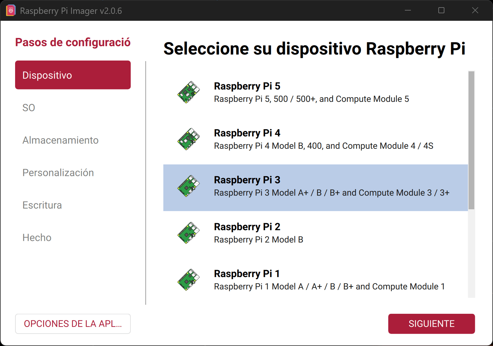
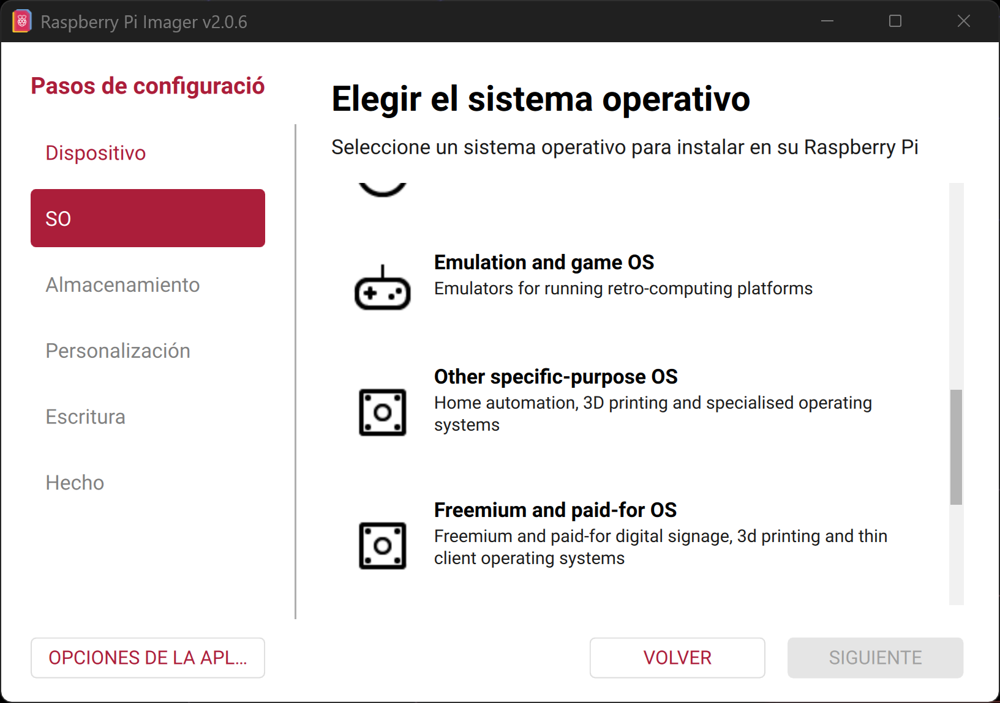
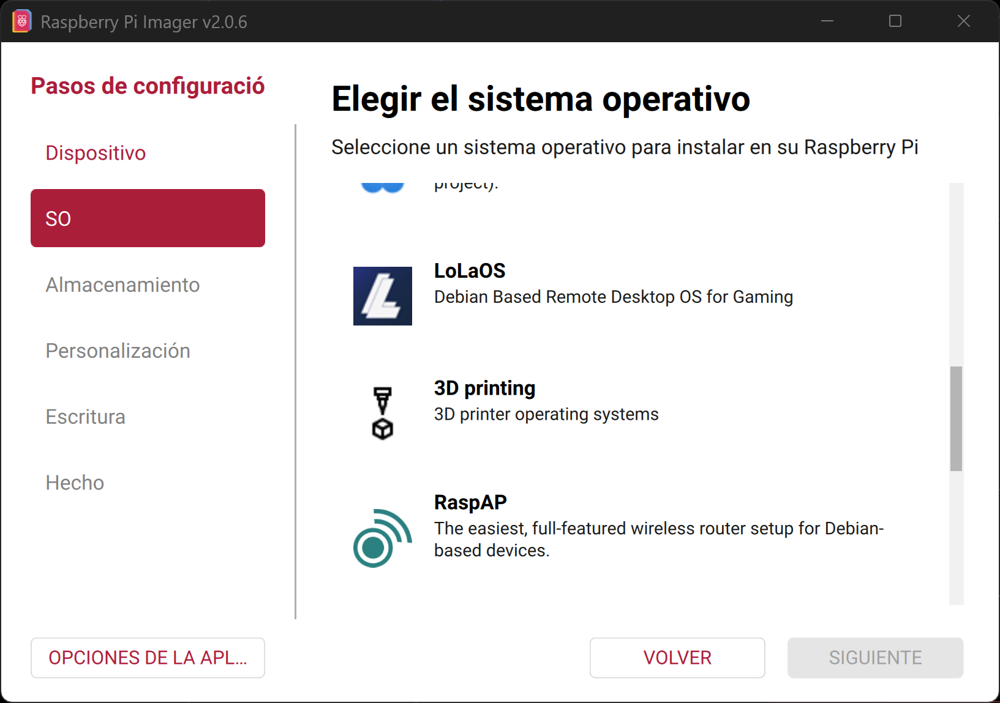
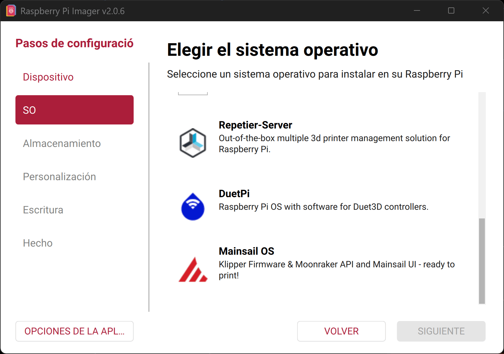
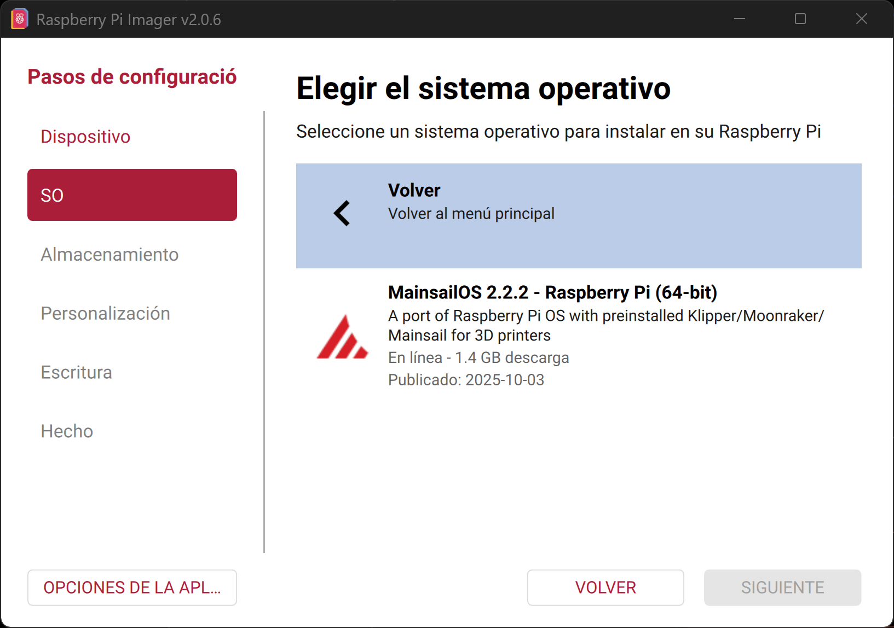
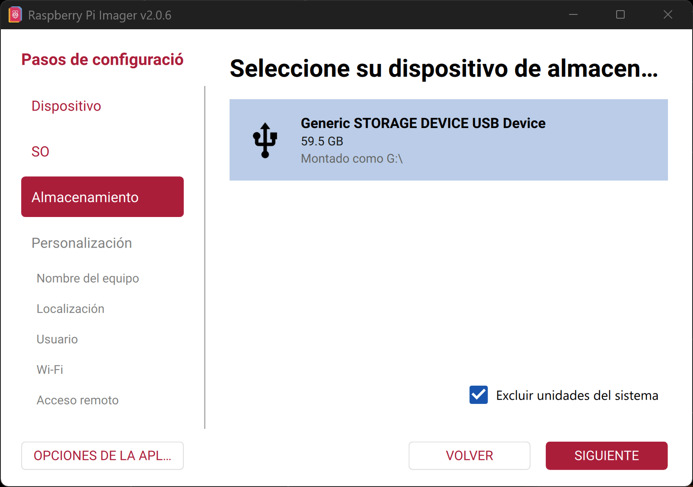
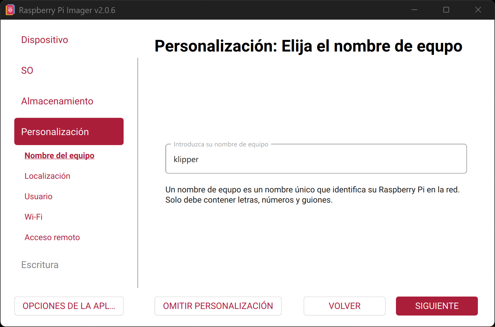
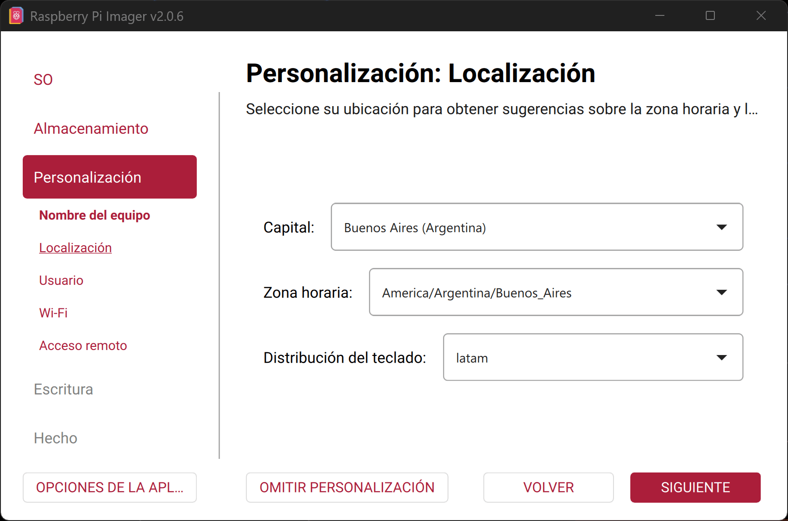

## 📦 Raspberry Pi Imager Installation

Follow these steps to flash your Raspberry Pi OS using Raspberry Pi Imager:

---

### 🔹 Step 1

  

---

### 🔹 Step 2

  

---

### 🔹 Step 3

  

---

### 🔹 Step 4

  

---

### 🔹 Step 5

  

---

### 🔹 Step 6

  

---

### 🔹 Step 7

  

---

### 🔹 Step 8

  

---

### 🔹 Step 9

  

---

### 🔹 Step 10

  

---

### 🔹 Step 11

  

---

### 🔹 Step 12

  

---

### 🔹 Step 13

  

---

### 🔹 Step 14

  

---

### 🔹 Step 15

  

