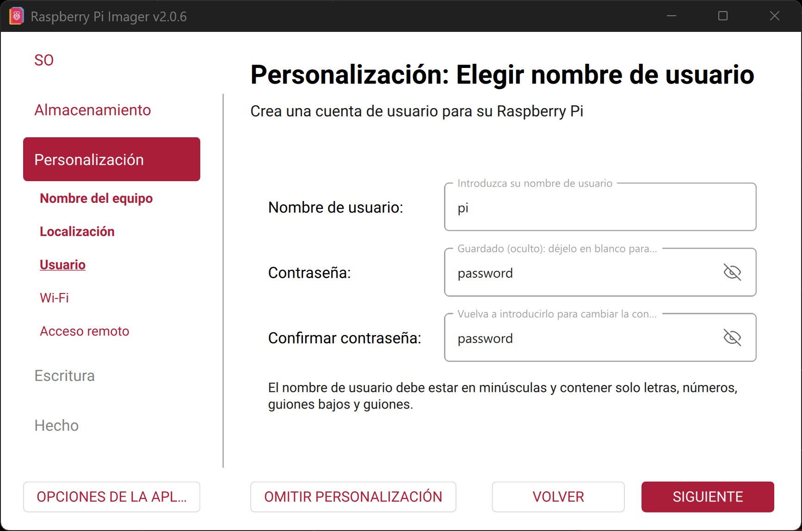
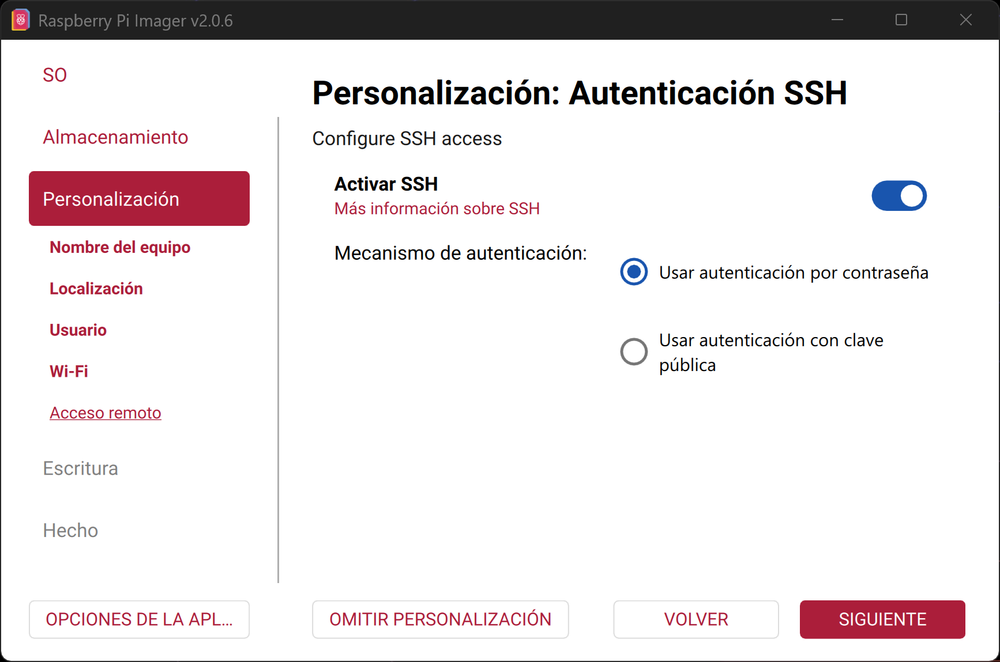
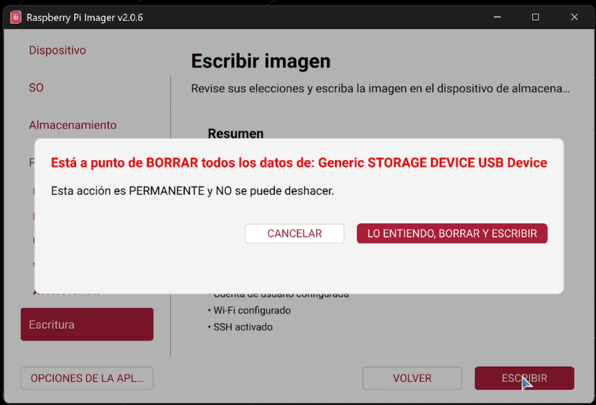
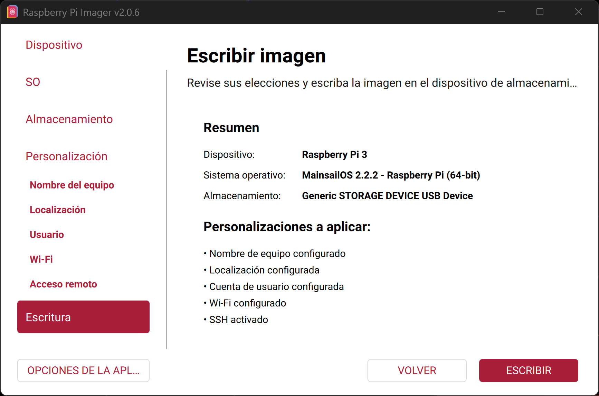

# 🍓 Configuração do Raspberry Pi Imager (Mainsail OS)

<p align="center">
  
</p>

---

Siga este guia passo a passo para instalar o **Mainsail OS** no seu Raspberry Pi usando o Raspberry Pi Imager.

---

### 🔹 Passo 1 — Abrir o Raspberry Pi Imager
<p align="center">
  
</p>

---

### 🔹 Passo 2 — Selecionar dispositivo
Escolha o modelo do seu Raspberry Pi.
<p align="center">
  
</p>

---

### 🔹 Passo 3 — Escolher sistema operacional
Selecione:
**Other specific-purpose OS**
<p align="center">
  
</p>

---

### 🔹 Passo 4 — Categoria 3D Printing
Selecione:
**3D Printing**
<p align="center">
  
</p>

---

### 🔹 Passo 5 — Selecionar Mainsail OS
<p align="center">
  
</p>

---

### 🔹 Passo 6 — Escolher versão
Selecione:
**Mainsail OS 2.x.x (Raspberry Pi)**
<p align="center">
  
</p>

---

### 🔹 Passo 7 — Selecionar armazenamento
Escolha o cartão SD.
<p align="center">
  
</p>

---

### 🔹 Passo 8 — Nome do dispositivo (Hostname)
Defina o nome do dispositivo  
Exemplo: `klipper`
<p align="center">
  
</p>

---

### 🔹 Passo 9 — Configuração regional
Configure:
- Fuso horário  
- Região  
- Layout do teclado  
<p align="center">
  
</p>

---

### 🔹 Passo 10 — Credenciais do usuário
Defina:
- Nome de usuário  
- Senha  
<p align="center">
  
</p>

---

### 🔹 Passo 11 — Configuração WiFi
Informe:
- Nome da rede (SSID)  
- Senha  
<p align="center">
  
</p>

---

### 🔹 Passo 12 — Ativar SSH
Ative a autenticação SSH para acesso remoto.
<p align="center">
  
</p>

---

### 🔹 Passo 13 — Gravar imagem
Inicie o processo de gravação.
<p align="center">
  
</p>

---

### ⚠️ Passo 14 — Aviso
Confirme o aviso para continuar.
<p align="center">
  
</p>

---

### 🔹 Passo 15 — Download e gravação
O sistema fará o download e gravará a imagem no cartão SD.
<p align="center">
  
</p>

---

### ✅ Passo 16 — Concluído
A gravação foi finalizada com sucesso.
<p align="center">
  
</p>

---

## 🚀 Próximo passo

Agora você pode:

1. Inserir o cartão SD no seu Raspberry Pi  
2. Ligá-lo  
3. Conectar via SSH usando ferramentas como **MobaXterm**  
   ou diretamente pelo navegador  

Use o hostname que você configurou:

```bash
klipper.local

