# ⚙️ KACE Installation (Klipper Automated Configuration Ecosystem)

<p align="center">
  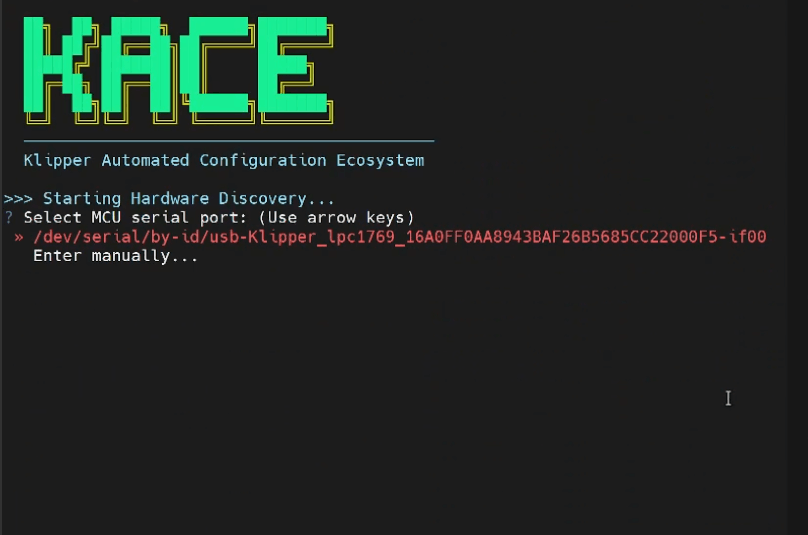
</p>

---

<p align="center">
  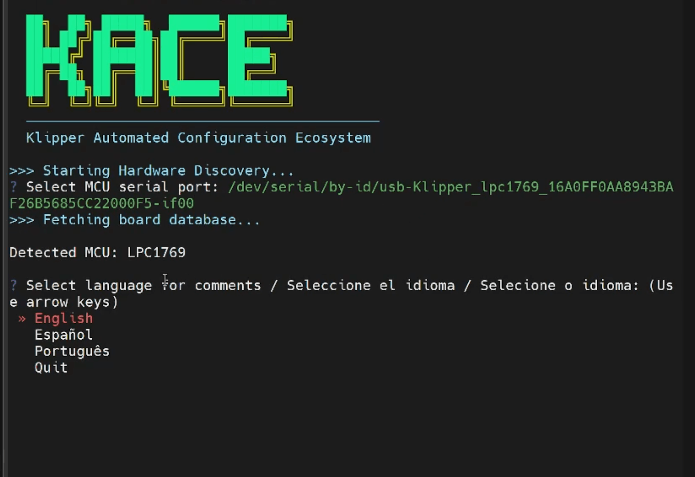
</p>

---

<p align="center">
  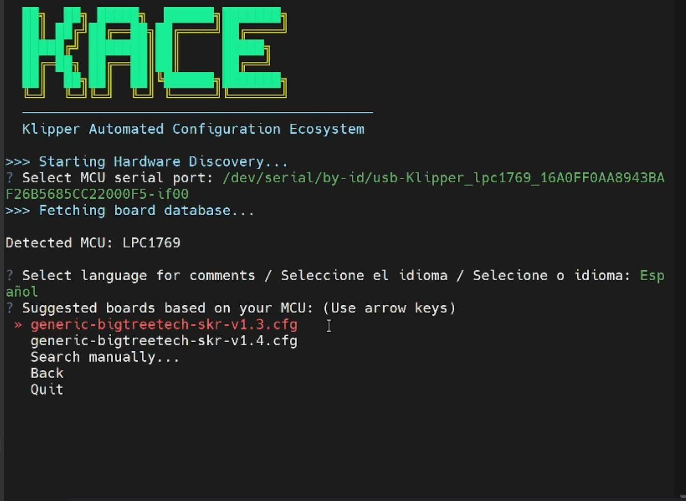
</p>

---

<p align="center">
  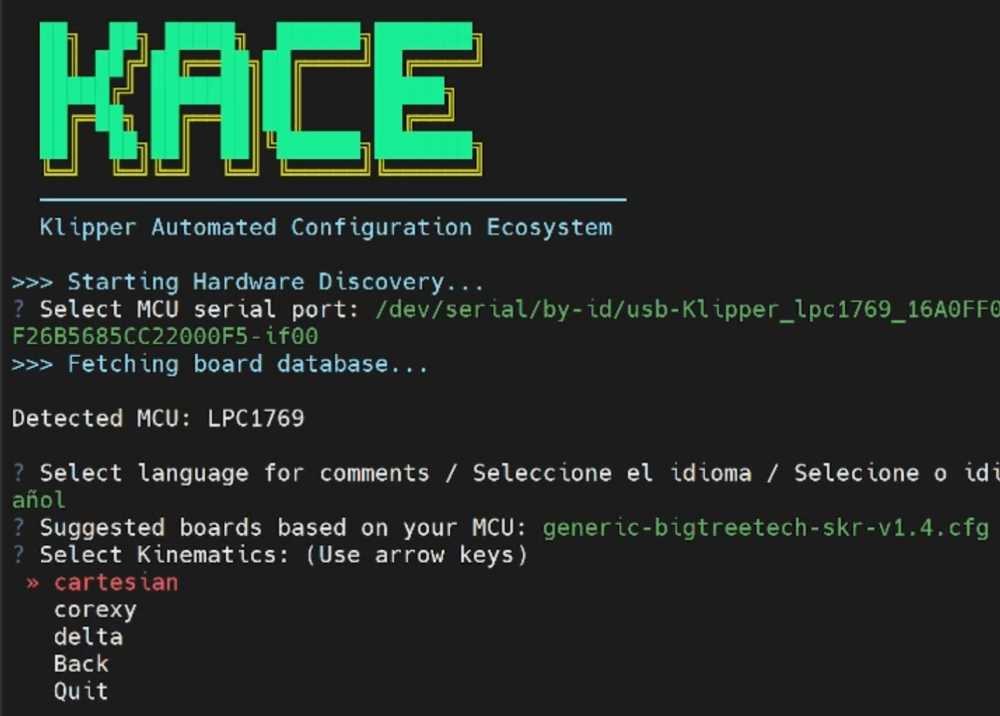
</p>

---

<p align="center">
  
</p>

---

<p align="center">
  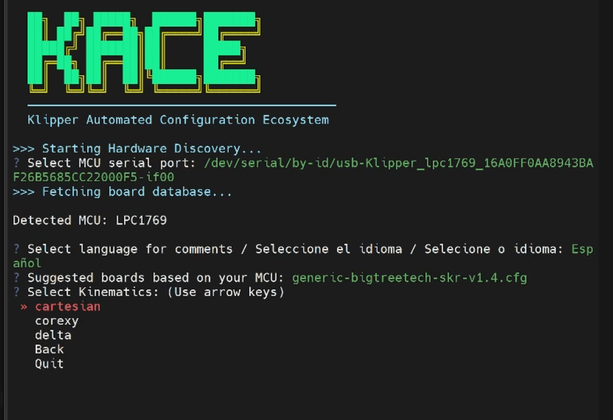
</p>

---

<p align="center">
  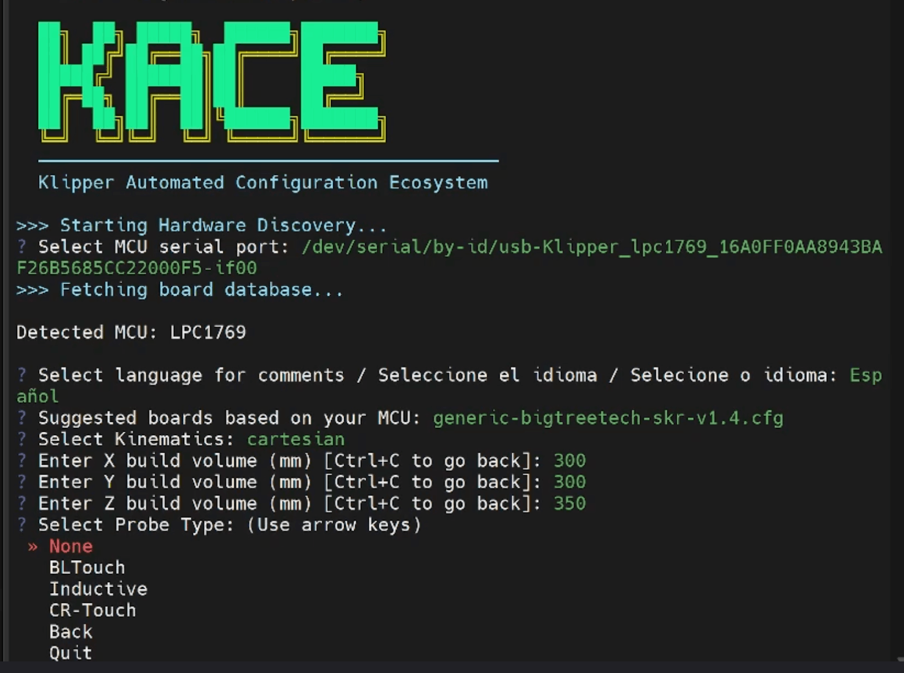
</p>

---

<p align="center">
  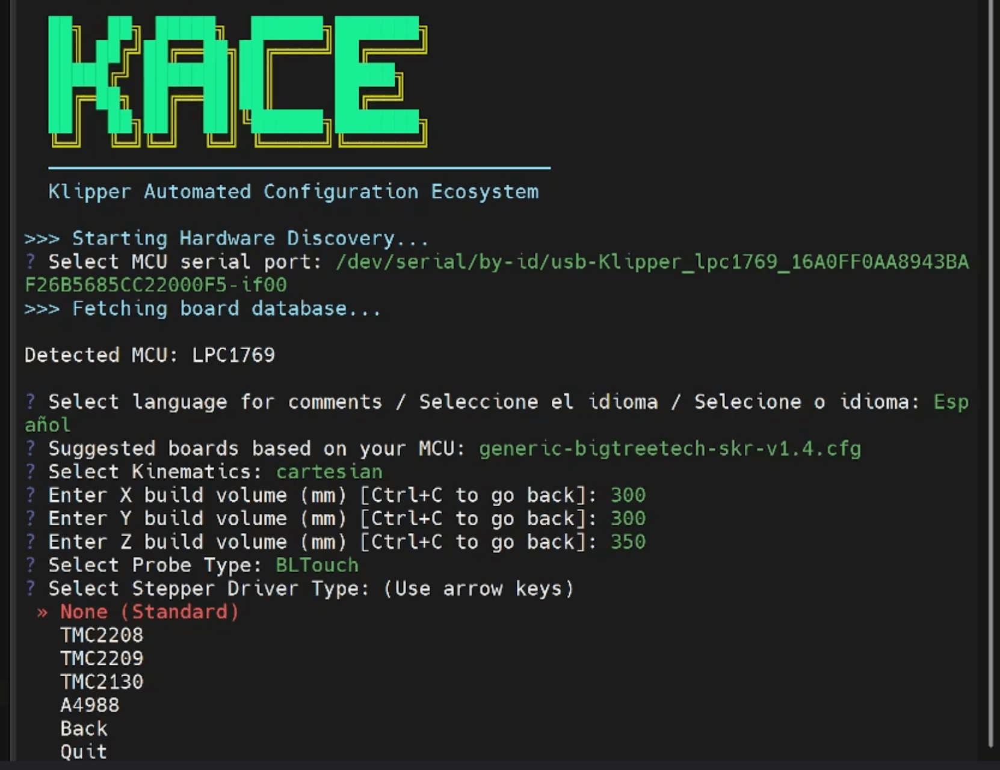
</p>

---

<p align="center">
  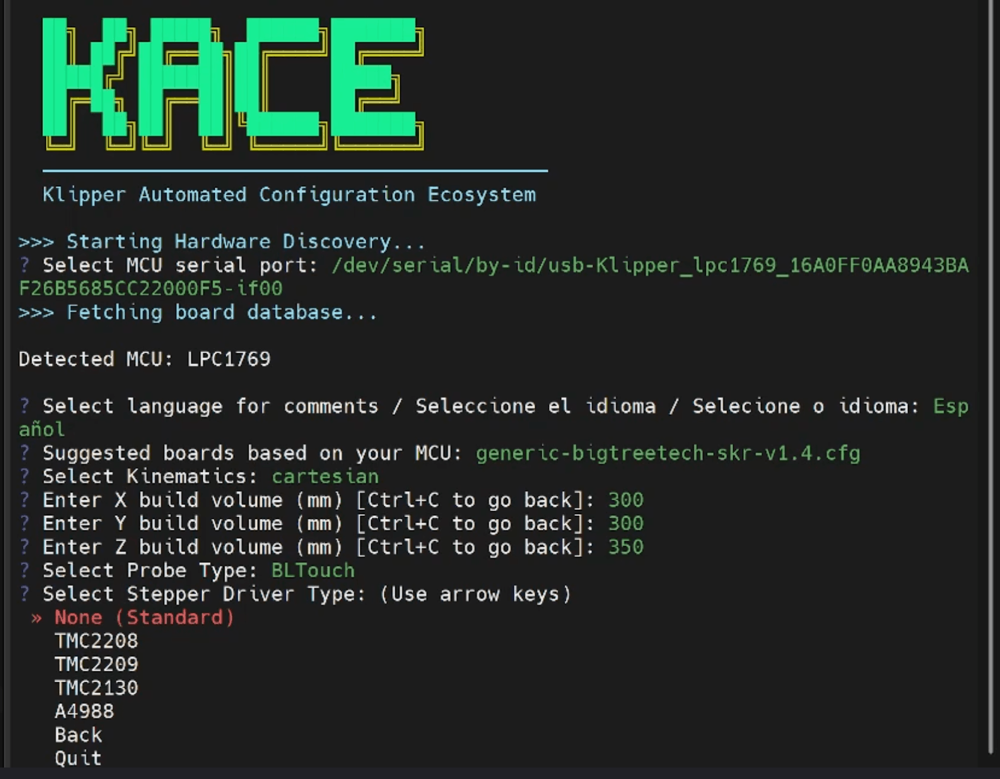
</p>

---

<p align="center">
  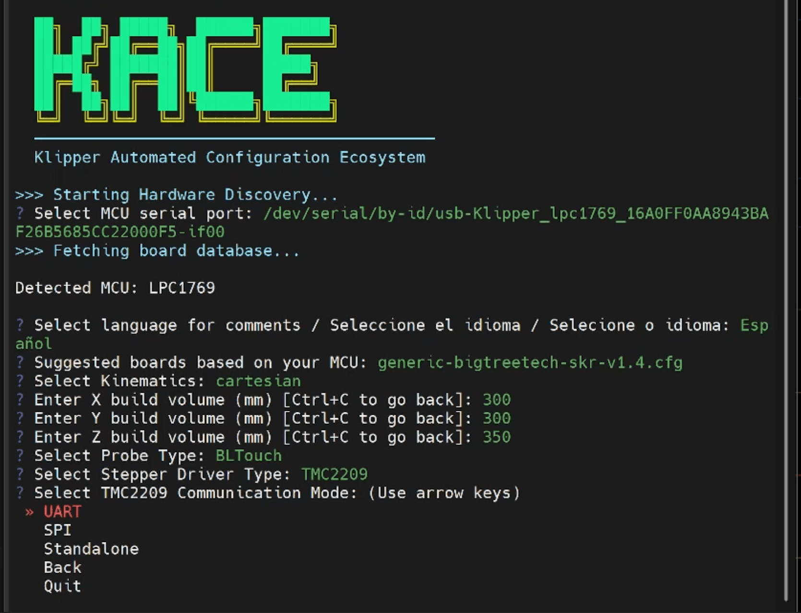
</p>

---

<p align="center">
  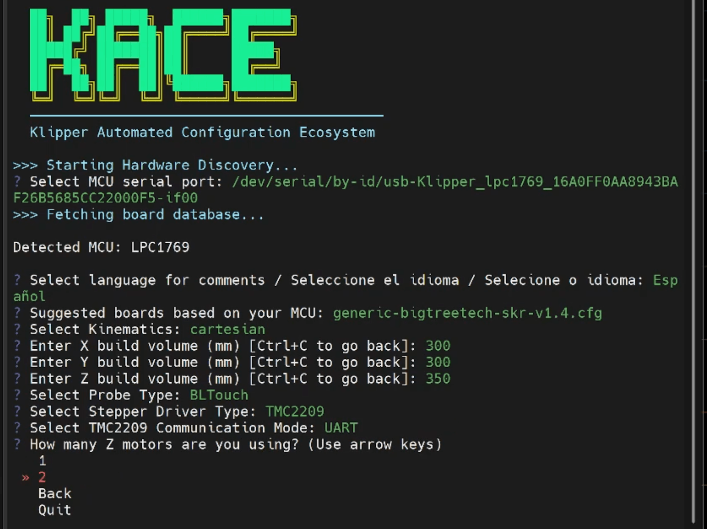
</p>

---

<p align="center">
  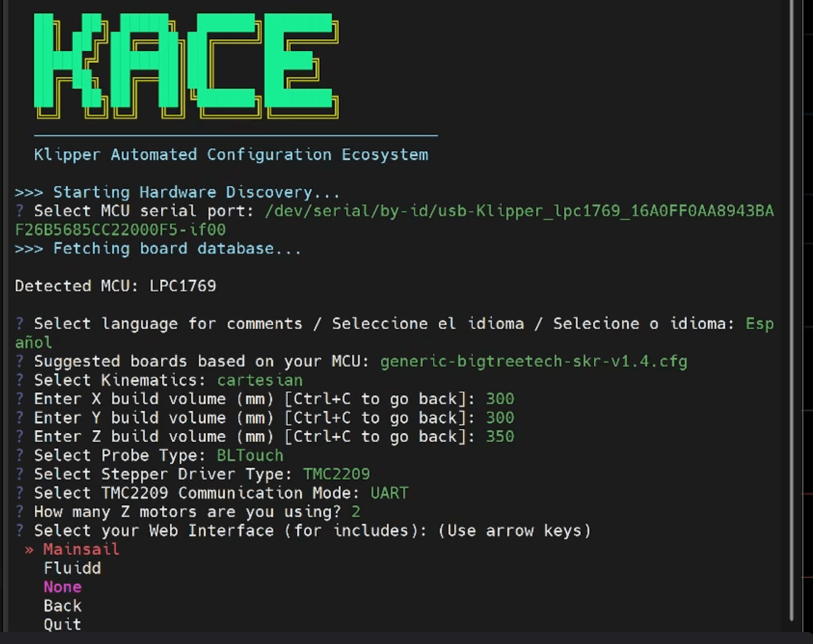
</p>

---

<p align="center">
  
</p>

---

## 🚀 Next Step

You can now:

- Access your printer interface  
- Start configuring your machine  
- Upload your printer profiles
- Enjoy automated Klipper setup with **KACE**

---

💡 **Tip:**  
Access your interface via:

```bash
http://klipper.local
```


