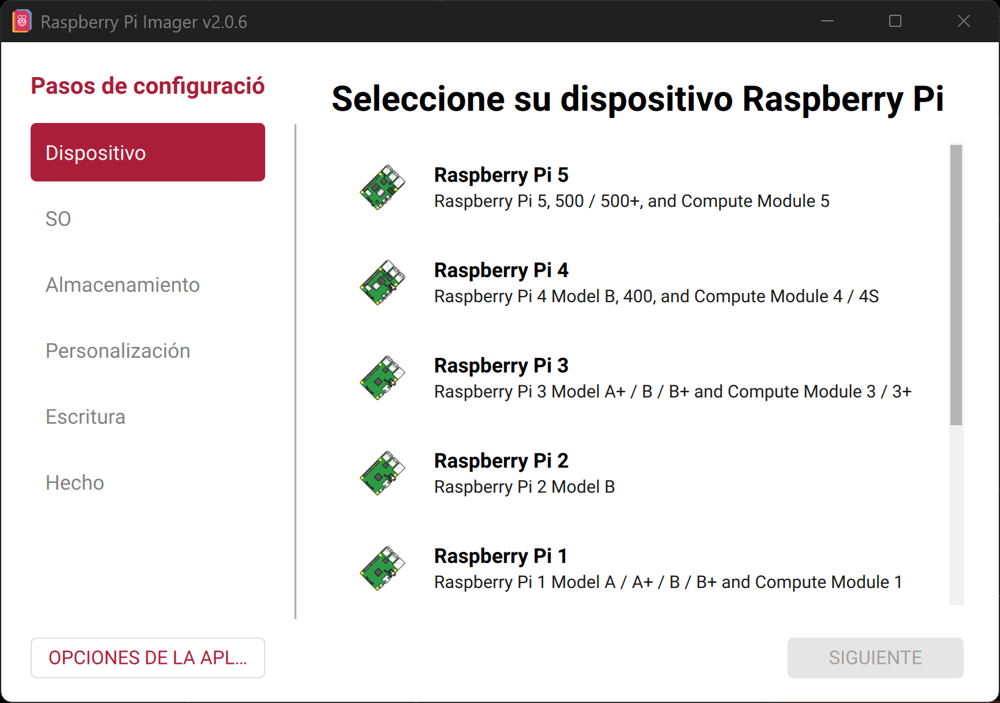
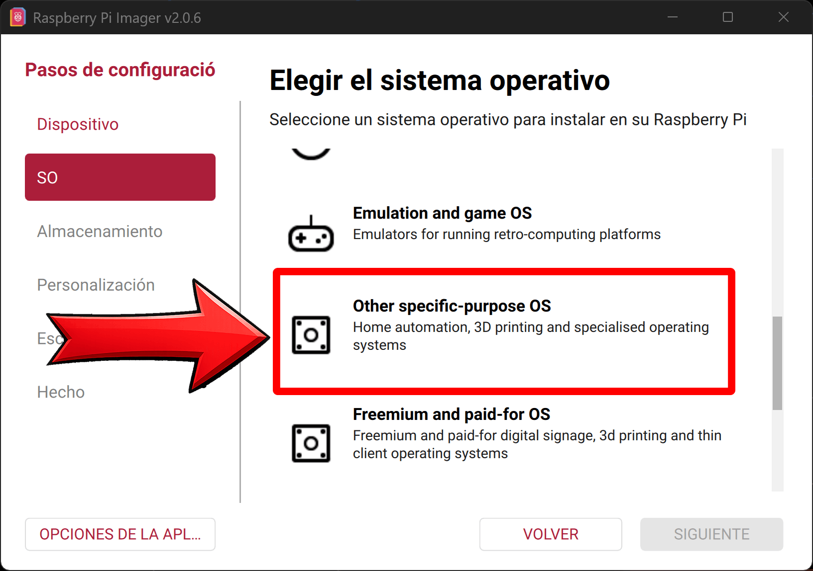
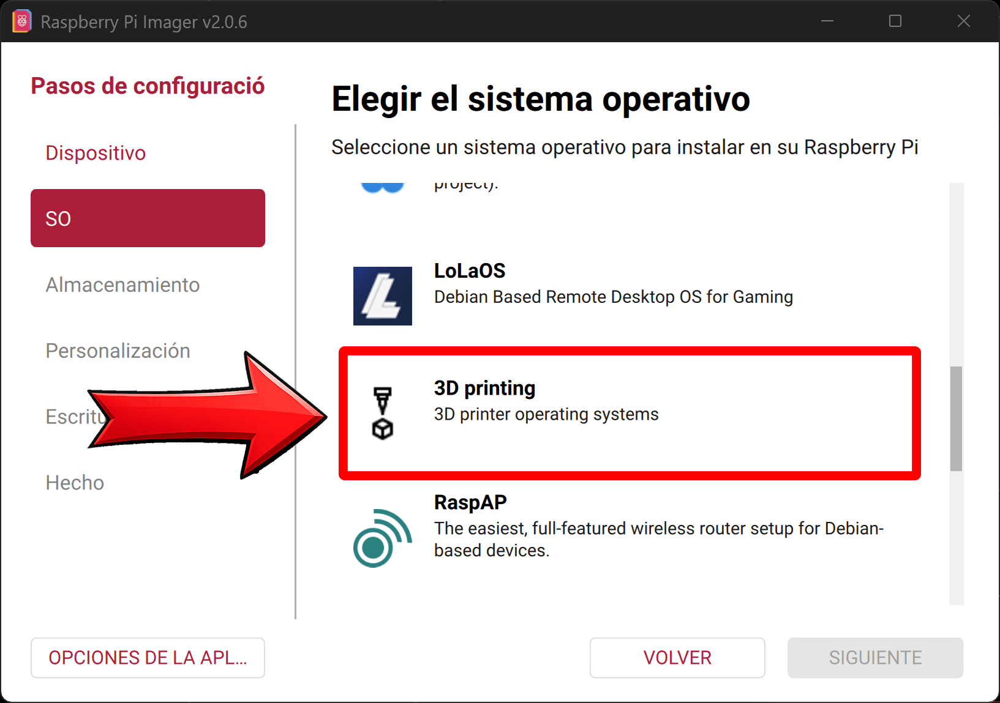
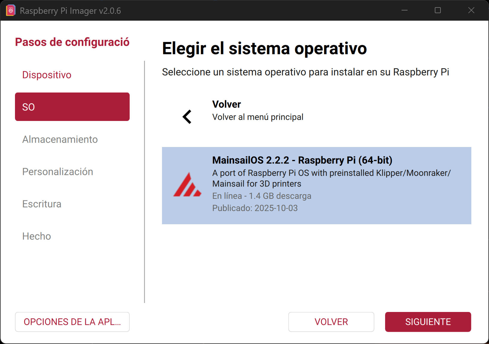
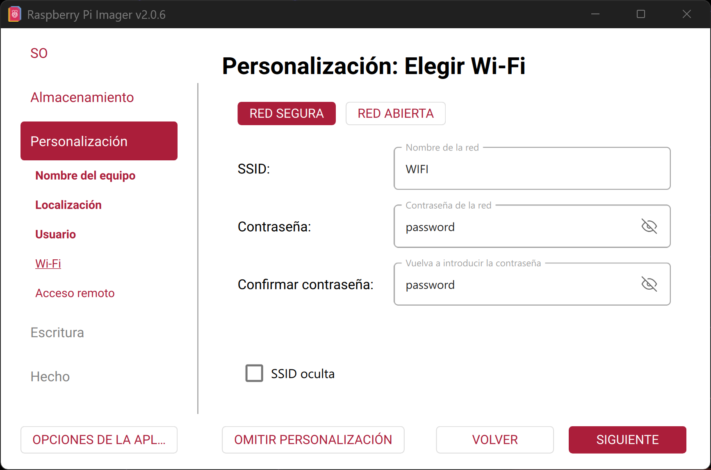
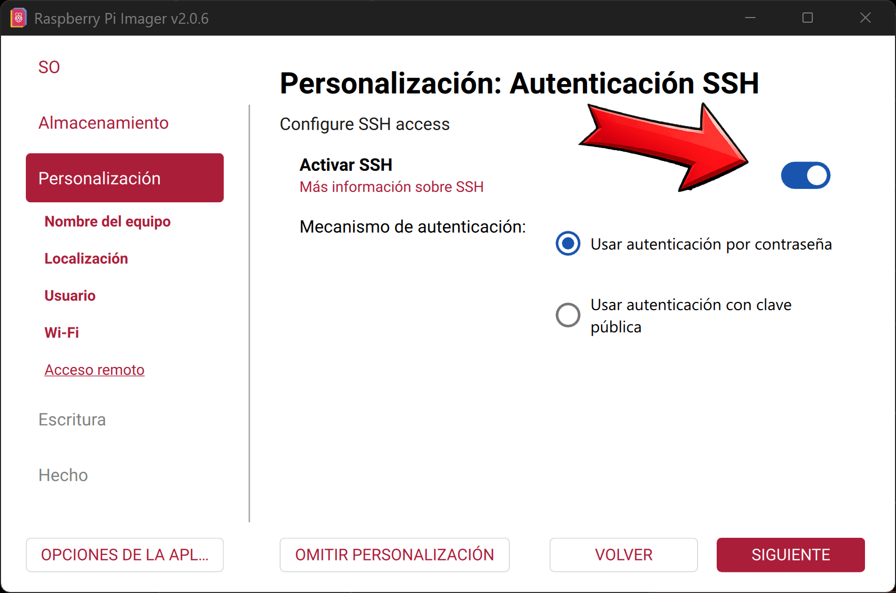
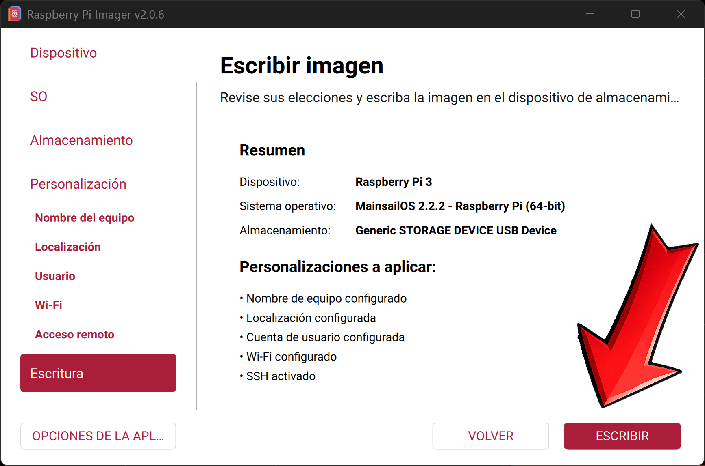
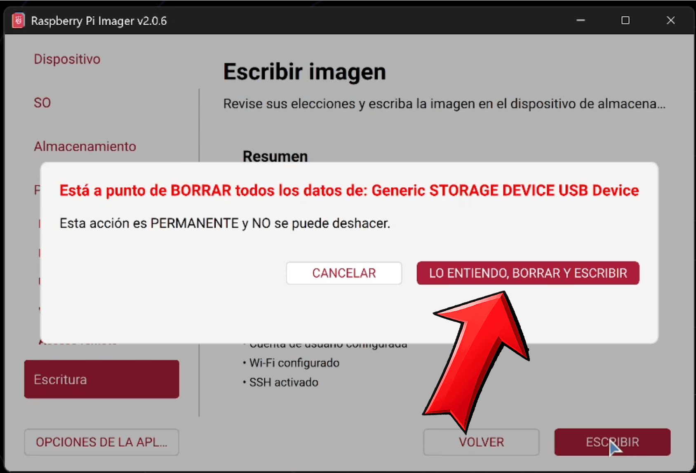
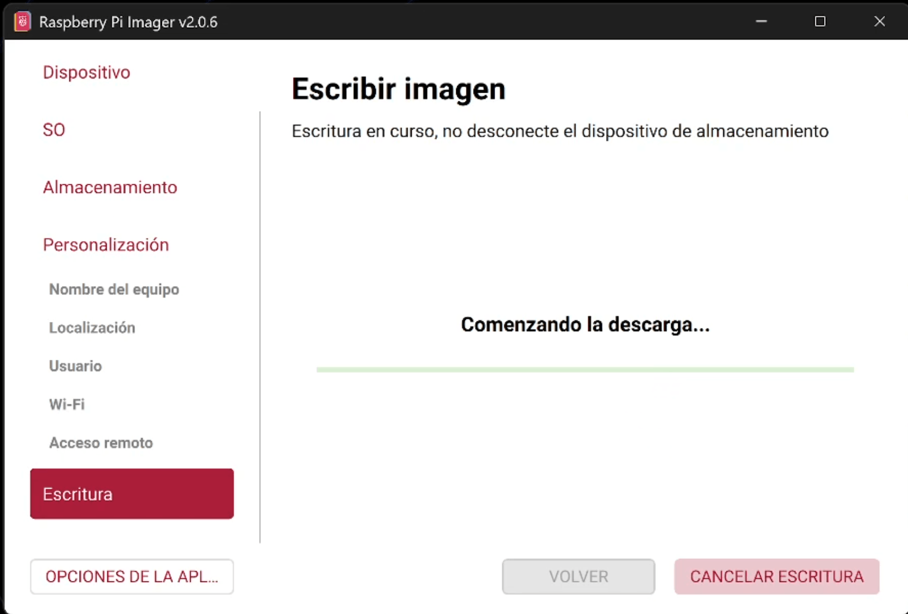
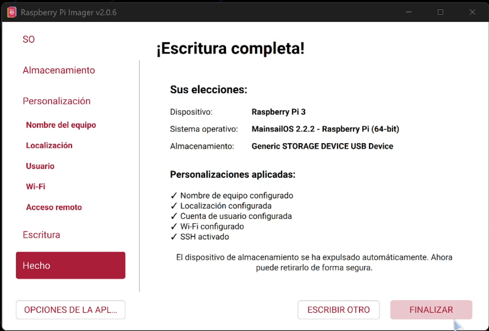

# 🍓 Configuración de Raspberry Pi Imager (Mainsail OS)

<p align="center">
  
</p>

<p align="center">

🌐 **Idioma**  
🇺🇸 <a href="../pi_imager.md">English</a> | 🇪🇸 Español | 🇧🇷 <a href="../pt/pi_imager.md">Português</a>

</p>

---

## 📦 Descripción

Esta guía te acompaña paso a paso para instalar **Mainsail OS** en tu Raspberry Pi usando Raspberry Pi Imager.

👉 Este es el **primer paso** antes de usar KACE.

---

## ⚠️ Antes de comenzar

Asegúrate de tener:

- Una Raspberry Pi  
- Una tarjeta microSD (recomendado: 16GB o más)  
- Conexión a internet estable  

💡 *Toda la configuración se realiza durante la grabación — no necesitas configuraciones adicionales después.*

---

### 🔹 Paso 1 — Abrir Raspberry Pi Imager
Abre la aplicación Raspberry Pi Imager.

<p align="center">
  
</p>

---

### 🔹 Paso 2 — Seleccionar dispositivo
Elige tu modelo de Raspberry Pi.

<p align="center">
  
</p>

---

### 🔹 Paso 3 — Elegir sistema operativo
Selecciona:

**Other specific-purpose OS**

<p align="center">
  
</p>

---

### 🔹 Paso 4 — Categoría 3D Printing
Selecciona:

**3D Printing**

<p align="center">
  
</p>

---

### 🔹 Paso 5 — Seleccionar Mainsail OS
Elige **Mainsail OS** de la lista.

<p align="center">
  
</p>

---

### 🔹 Paso 6 — Elegir versión
Selecciona:

**Mainsail OS 2.x.x (Raspberry Pi)**

<p align="center">
  
</p>

---

### 🔹 Paso 7 — Seleccionar almacenamiento
Elige tu tarjeta SD.

⚠️ *Asegúrate de seleccionar el dispositivo correcto — todos los datos serán eliminados.*

<p align="center">
  
</p>

---

### 🔹 Paso 8 — Nombre del equipo (Hostname)
Define el nombre del dispositivo.

Ejemplo:
```bash
klipper
````

💡 *Lo usarás luego para conectarte por red.*

<p align="center">
  
</p>

---

### 🔹 Paso 9 — Configuración regional

Configura:

* Zona horaria
* Región
* Distribución del teclado

<p align="center">
  
</p>

---

### 🔹 Paso 10 — Credenciales de usuario

Define:

* Nombre de usuario
* Contraseña

💡 *Guarda estos datos — los necesitarás para SSH.*

<p align="center">
  
</p>

---

### 🔹 Paso 11 — Configuración WiFi

Ingresa:

* Nombre de red (SSID)
* Contraseña

💡 *Asegúrate de que sea la red correcta.*

<p align="center">
  
</p>

---

### 🔹 Paso 12 — Habilitar SSH

Activa la autenticación SSH.

👉 Este paso es **crítico** para acceder remotamente a la Raspberry Pi.

<p align="center">
  
</p>

---

### 🔹 Paso 13 — Escribir imagen

Inicia el proceso de grabación.

<p align="center">
  
</p>

---

### ⚠️ Paso 14 — Advertencia

Confirma el mensaje para continuar.

<p align="center">
  
</p>

---

### 🔹 Paso 15 — Descarga y grabación

El sistema:

* Descargará el sistema operativo
* Lo escribirá en la tarjeta SD

⏳ *Este proceso puede tardar algunos minutos.*

<p align="center">
  
</p>

---

### ✅ Paso 16 — Completado

La grabación finalizó correctamente.

<p align="center">
  
</p>

---

## 🚀 Siguiente paso

Ahora puedes:

1. Insertar la tarjeta SD en la Raspberry Pi
2. Encenderla
3. Conectarte por SSH usando herramientas como **MobaXterm**
   o desde el navegador

Usa el hostname que configuraste:

```bash
klipper.local
```

---

💡 **Tip:**
Si `klipper.local` no funciona, busca la IP desde tu router.


